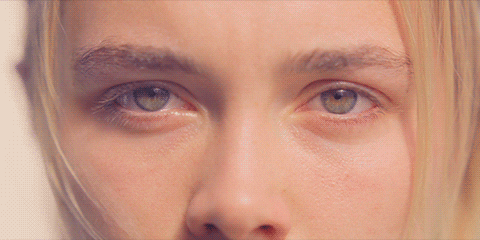

```{r include=FALSE}
#We need some packages!
#if you don't have those uncomment the following lines and install the packages:
#install.packages('plyr')
#install.packages('dplyr') 
#install.packages('ggplot2') 
#install.packages('tidyr') 

#now load them
library(plyr)
library(dplyr)
library(ggplot2)
library(tidyr)
```


##Goal today: 

*Getting familiar with eye-tracking and getting huge eye-data files in a small format, creating time bundles and do some basic eye-tracking plots!*

**A very brief overview**:  

**The data**: from hearing speakers (3) and deaf signers (4).   

**Task**: we presented 4 picture displays. They had to describe the picture at which an arrow pointed.

**Method**: We meassured eye-gaze while they planned to describe the pictures ("VisualDisplay").  
Do speakers look at other pictures than deaf signers during the VisualDisplay?  

<div class="columns-2">
**Our manipulation**: spatial relations  (left/right/front/behind/on).  
  { width=50% }
</div>
***

##I got dirty for you and cleaned up the mass
 
We are not going much into detail here.   
I basically cleaned it for you and perhaps the code becomes handy later on for you:

- The eye_data comes fresh out of the eye-tracker so variables are not named in a nice fashion.   
- Thus I renamed it so they make more sense. 
- In my case, we have not only the eye-tracker data but also one from the experiment programm (logging reaction times, button presses etc.)  
- finally: I merged eye_data and log_data so we have all info in one dataframe  
     
```{r echo=FALSE, warning=FALSE, message=FALSE, cache=TRUE}

#let's load in data and check how it looks like
#eyedata
eye_data <-  read.delim("eye_data.txt", header = T, sep = "\t", stringsAsFactors = FALSE)

#logfile
log_data <-  read.delim("log_data.txt", header = T, sep = "\t", stringsAsFactors = FALSE)

#######################
#Cleaning the eye_data#
#######################
  #we want more "pretty" column names
  eye_data <- plyr::rename(eye_data, c("Participant" = "Subject", "Event.Start.Trial.Time..ms."="Fix.Start", "Event.End.Trial.Time..ms."="Fix.End", "Event.Duration..ms."="Fix.Dur", "AOI.Name"="Area", "Tracking.Ratio...." = "TrackingRatio"))
  
  #specify whether they are a factor, character, or numeric
  # %>% is called piping, with this we don't need always to specify the dataframe 
  eye_data <- eye_data %>% mutate(Trial = as.factor(Trial), Subject = as.factor(Subject), Category = as.factor(Category), Area = as.factor(Area)) 

  #let's remove all the strings in column "Trial"
  levels(eye_data$Trial) <-sub("Trial00", "", levels(eye_data$Trial))
  levels(eye_data$Trial) <-sub("Trial0", "", levels(eye_data$Trial))
  levels(eye_data$Trial) <-sub("Trial00", "", levels(eye_data$Trial))
  
  #Replace character values in Participant column with a blank
  levels(eye_data$Subject) <-sub("_StatLing_EYE", "", levels(eye_data$Subject))
  droplevels(eye_data)-> eye_data

#######################  
#cleaning the log_data#
#######################
  
  #variable cleaning
  log_data <- log_data %>% mutate(Subject = as.factor(Subject), Language = as.factor(Language), Trial = as.factor(Trial), ID = as.factor(ID), Type = as.factor(Type), SpatialRelation = as.factor(SpatialRelation), TargetPic = as.factor(TargetPic), ContrastPic = as.factor(ContrastPic), CompPic = as.factor(CompPic), DistrPic = as.factor(DistrPic), Pic1Position = as.factor(Pic1Position), Pic2Position =  
  as.factor(Pic2Position), Pic3Position = as.factor(Pic3Position), Pic4Position = as.factor(Pic4Position), TrialStartTime =   as.numeric(TrialStartTime), PreviewTime = as.numeric(PreviewTime), ArrowTime = as.numeric(ArrowTime), VisualDisplayTime =   as.numeric(VisualDisplayTime), NoiseDisplayTime = as.numeric(NoiseDisplayTime), TrialEndTime = as.numeric(TrialEndTime))

#########
#merging#
#########
  #hange on- We are not ready to merge the two files yet: 
  #there is now one issue -> the column "Trial" in both files is not referring to the same thing (why? looong storry). 
  #So let's just kick it out and rename the actual trial column (now called "ID). 
  log_data$Trial <- NULL
  log_data <- plyr::rename(log_data, c("ID" = "Trial"))
  droplevels(log_data)-> log_data
  
  #all pretty?
  #yes!
  #so let's merge
  alldata <- left_join(log_data, eye_data)
  alldata <- alldata %>% mutate(Subject=as.factor(Subject))
 
  #there are still some columns we don't need/want so we select the ones we want to keep and change some classes
  alldata <- alldata %>% select(Trial, Subject, Category, Fix.Start, Fix.End, Fix.Dur, Area, Content, Language,Type,  SpatialRelation, TargetPic, ContrastPic, CompPic, DistrPic, Pic1Position,  Pic2Position, Pic3Position, Pic4Position, TrialStartTime, PreviewTime, ArrowTime, VisualDisplayTime, NoiseDisplayTime, TrialEndTime) %>% mutate(Subject = as.factor(Subject), Fix.End = as.numeric(Fix.End), Fix.Dur = as.numeric(Fix.Dur), SpatialRelation=as.factor(SpatialRelation))
    
  #remove Practice and Filler items, keep only the experimental items (they are called EN and EC - I explain later)
  alldata <- alldata %>% filter(Type %in% c("EN", "EC"))
```

##Let's have a closer look at the data
```{r echo=FALSE, warning=FALSE, message=FALSE,  cache=TRUE}
alldata
```
Most important are:  
*- Fix. columns*:  our eye-gaze data: when it starts ends and its duration.  
*- Category*: indicates whether it is a fixation, blink, saccade etc.     
*- Area*: shows us at which picture participants look (at the one in the left upper corner, or right upper, left lower, right lower).  

***
##Blinks - are eye-catchers that we don't want

Let's get into the real business. 

**Aim**: making the file smaller and smaller. 

**Starting with**: filtering out the blinks.   

Blinks are basically moments in which the eye-tracker couldn't track the eye (because they where closed).  

**-> noise!**   

{ width=25% }


We want to get rid of it!  

***

##DIY #1!
Try to remove blinks.   
Looks easy - we have a column called *Category* that say's *Blink* now and then.    

**The catch**: Blinks are basically track loss and in turn, track loss (-> eye-tracker couldn't find the eyes for other reasons) are also called Blinks.  

Usually, We want to know how much data we lose per participant.   
If too much - then we need to exclude the participant.  

**Tip**: we use a treshold of 35%. If blinks exceed this value we exlude the participant  
```{r DIY calculate blinks, include=FALSE}
 
```
***
##My way

There is no right or wrong way!  

My way:  
- create a new file - I selected only eye-data during one moment of the trial (0-3500ms)  
-  aggregated over Subject and calculated a blink-percentage per subject across all trials:  
   using number of trials (here 28) and the length of our time window (here 35000ms)    
-calculate the percentage of blink duration per subject over all experimental trials (N=28, total length of window of interest: 98000 (N*3500))
```{r calculate blinks, echo=TRUE, warning=FALSE, message=FALSE, cache=TRUE}
  blinks <- alldata %>% filter(alldata$Fix.Start, between(Fix.Start, 0, 3500))%>% 
                        select(Fix.Start, Fix.Dur, Trial, Category, Content, Subject) %>% 
                        mutate(Fix.Start = as.numeric(Fix.Start), Fix.Dur = as.numeric(Fix.Dur), Content = as.factor(Content), Subject =  as.factor(Subject))

  #spread category, so that we have each in one column 
  #(because we want to aggregate blinks only)
  blinks <- blinks %>% spread(Category, Fix.Dur)
  blinks$Blink[is.na(blinks$Blink)] <- 0
  
  #aggregate over subjects
  blinks <- aggregate(blinks$Blink, by=list(Subject=blinks$Subject), sum)
  #calculate the percentage of blink duration 
  blinks$blinks = (blinks$x * 100) / 98000 #looks good except my "problem signer" (85% for 205). 
  blinks
```
***

This looks all good.   

Only one participant had too much track loss = 205   

Since this is only one we exlude this one manually. You could also write code that excludes pps directly.  

```{r echo=FALSE, warning=FALSE, message=FALSE, cache=TRUE}
#exclude subjects with too much trackloss
  alldata=alldata[!alldata$Subject == "205",] 

#since we know now the amount of blinks we can get rid of them
  alldata <- alldata %>% filter(Category %in% c("Fixation")) %>%
                         filter(!Area %in% c("White Space", "-")) ## White space comes from the eye-tracker. It refers to looks outside of interest areas. 
#we don't need these two columns anymore
  alldata$Category <- NULL
  alldata$Content<- NULL
```

***

##Area of interests (AoIs)
Now it gets interesting.   
 
If you look at the column *Area* we see at which picture position participants looked at:   

PicPos1: left upper picture  
PicPos2: right upper picture  
PicPos3: left lower picture  
PicPos4: right lower picture  
{ width=77% }

***
But we want to know more! Namely, what is on the pictures:  
   
The order of those changes per trial.   

So how can we assign the picture postions to our actual manipulations?

##DIY #2!
**Task**: Assing *target, contrast, competitor, distractor* to the column *area*.  

Tips:  

- the content of *area* 1,2,3,4 refers to the picture positions. 
- In the colmuns *Pic1Position - Pic4Position* you can find out what is in each PicPosition:  

6: target,  
7: contrast,  
8. competitor  
9. distractor

  

```{r DIY assign AoIs, inlcude=FALSE}
 
``` 
***

## My Way:

Basically, PicPosition...:  
...6 refers to the target picture, 
...7 refers to the the contrast picture  
...8 refers to the competitor picture  
...9 refers to the distractor picture  

So I created a loop that looks inside *Area*, which PicPosition people look at and goes then into *PicPosition* collumns accordingly.   

```{r preparing AoIs, echo=TRUE, warning=FALSE, message=FALSE, cache=TRUE}
  levels(alldata$Area) <-sub("PicPos", "", levels(alldata$Area))
  levels(alldata$Area) <-sub("Arrow", "5", levels(alldata$Area))
  
  #Change PicPositions (factor) 6-7-8-9 to 1-2-3-4 (numeric)
  alldata <- alldata %>%mutate(Pic1Position=as.numeric(Pic1Position), Pic2Position=as.numeric(Pic2Position), Pic3Position=as.numeric(Pic3Position), Pic4Position=as.numeric(Pic4Position))
  alldata$Area <- ifelse(alldata$Area==1, alldata$Pic1Position,
                    ifelse(alldata$Area==2, alldata$Pic2Position,
                    ifelse(alldata$Area==3, alldata$Pic3Position,
                    ifelse(alldata$Area==4, alldata$Pic4Position,
                    ifelse(alldata$Area==5, 5,
                    NA  )))))
  
  alldata<- alldata %>%mutate(Area=as.factor(Area))
  levels(alldata$Area) <-sub("1", "target", levels(alldata$Area))
  levels(alldata$Area) <-sub("2", "contr",  levels(alldata$Area))
  levels(alldata$Area) <-sub("3", "comp",   levels(alldata$Area))
  levels(alldata$Area) <-sub("4", "distrA", levels(alldata$Area))
  levels(alldata$Area) <-sub("5", "arrow",  levels(alldata$Area))
  droplevels(alldata)-> alldata
``` 

***

##Bins
{ width=25% } 

*= small time bundles to analyze data and changes over time. *

- size can vary (from 25ms to whole seconds), depending on research question and data type  
- in language science we often have bins between 25ms and 100 ms.  

**How do they work?**  
- you basically look a each fixation's start and end time and calculate whether a fixations falls in a certain bin.

For example:   
- in the first line of alldata there is a fixation starting at 3.3ms (after trial start) and ending at 163.3     
- let's say we create 50ms bins:    
- bin 0 (0ms-50ms) get's a 1,       
- bin 50 (50ms-100ms) gets a 1, 
- bin 100 (100ms-150ms) gets a 1,  
- bin 150 (150ms-200ms) gets a 1,
- bin 200 (200ms-250ms) gets a 0
- and so on
  
- This way you can analyze eye-gaze over time

***
And this is what the code below does.  

Result:   
```{r binning, echo=FALSE, warning=FALSE, message=FALSE,  cache=TRUE}

  STIM=unique(alldata$Trial)
  BIN=seq(0,3500,50)                #### NB! change number here for a different time window (i.e., start, end, bin size),
  AOI=unique(alldata$Area)
  PP=unique(alldata$Subject)
  
  ## build new dataframe
  BIN2=rep(BIN, length(STIM))
  STIM2=sort(rep(STIM, length(BIN)))
  ALLDATA=data.frame(bin=BIN2, stim=STIM2)
  
  droplevels(ALLDATA) -> ALLDATA

  ##5 times all rows (1 because of 1 row per AOI)
  ALLDATA=ALLDATA[rep(1:nrow(ALLDATA),each=length(AOI)),] 

  ##add AOIs, we have 5 AOIs (target, contrast, competitor, distrA, arrow)
  ALLDATA$aoi=rep(AOI, nrow(ALLDATA)/5)
 
  #this loop takes a while
  for (j in unique(alldata$Subject)){
    ALLDATA[,ncol(ALLDATA)+1]=0
    ff=alldata[alldata$Subject==j,]
    for (i in 1:nrow(ff)){
     targets=intersect(grep(ff$Trial[i], ALLDATA$stim), grep(as.character(ff$Area[i]), ALLDATA$aoi))
     for (k in targets){
        if((ALLDATA$bin[k]+50)>=ff$Fix.Start[i] & ALLDATA$bin[k]<ff$Fix.End[i]){
         ALLDATA[k,ncol(ALLDATA)]=1
        }	}	}	} 
  
  colnames(ALLDATA)[4:23] <- c("201", "202", "203", "204", "205", "206", "207", "208", "209", "210", "51", "52", "53", "54", "55", "56", "57","58", "59", "60")
  ALLDATA
```

***

## Almost there    

Often in those types of eye-tracking experiments we caluclate fixation proportions to analyze and plot the data.   

*Let's calculate them!*

- we structure the Subjects in a vertical format (=gather), so we have one column with all Subjects in it  
- we create a column with group information (if you have groups)  
- we structure AoI horizontally, so we have one column for each AoI  
- we create a sum of rows (multiplying the 0 and 1s in each row acorss all AoIs)  
- filtering out rows with only 0s  
- caluculating proportions per AoI (for me target, contrast etc.): amount of fixations for one AoI devided by the total number of fixation  
- and this we do per bin, item, and subject  

```{r reshape files and calculate fixation proportions, echo=FALSE, warning=FALSE, message=FALSE,  cache=TRUE}  
  #we need the data in a long format, thus we gather/transform the data and clean up the variable names (with mutate)
  #recap: fancy code explanation: %>% is called piping and can combine different functions and avoids endless specifying of the data frame 
  ALLDATA <- ALLDATA %>% gather(key=Subject, value= x, "201":"60")%>%
                         mutate( Subject=as.factor(Subject), aoi=as.factor(aoi))
  
  #add group details (1=speakers, 2=signers)
  ALLDATA$group <-  ALLDATA$Subject
  ALLDATA$group <-  gsub('(5.+)',1,ALLDATA$group)    #speakers have pp numbers from 51-71 (thus starting with 5,6,and 7)
  ALLDATA$group <-  gsub('(6.+)',1,ALLDATA$group)
  ALLDATA$group <-  gsub('(2.+)',2,ALLDATA$group)    #signers have pp numbers from 201-222 (all starting with 2)
  ALLDATA <- ALLDATA %>% mutate (Subject = as.factor(Subject), group = as.factor(group))

  #spread out data by aois (i.e., havin one column for each aoi) and change variable types (again we pipe the 2 functions (spread + mutate) together)
  ALLDATA <- ALLDATA %>% spread(aoi, x)
  
  #create sum of fixations, collumn 7 to 12 (arrow, comp, distrA, distrB, target, contr)
  #we use this column to calculate fixtion proportions and to exlude the lines in which pps didn't look at anything
  ALLDATA$N <- rowSums (ALLDATA[,5:9], na.rm = TRUE)
  
  #now we filter out the ones with total amount of fixations =0 (sometimes the are instances in which Subjects do not look at anything)
  ALLDATA <- ALLDATA %>% filter(N != 0)


 #calculate proportions
 ALLDATA$propfix_target <- (ALLDATA$target) / (ALLDATA$N) #note that pps who don't look at any things (in certain bins) get a NaN, creates problems later on...
 ALLDATA$propfix_comp   <- (ALLDATA$comp)   / (ALLDATA$N)
 
 ALLDATA$propfix_contr  <- (ALLDATA$contr)  / (ALLDATA$N)
 ALLDATA$propfix_arrow  <- (ALLDATA$arrow)  / (ALLDATA$N)
 ALLDATA$propfix_distr  <- (ALLDATA$distrA)  / (ALLDATA$N) # distrA, distrB fixations
 ALLDATA
```

***

## DIY #3 - Plot!

Be creative and make some nice plots.  

**Tip**: geom_line often works well.   

```{r plot, include=FALSE}

```

***

## My way - an example

```{r plot  data, echo=FALSE, warning=FALSE, message=FALSE, cache=TRUE, fig.height = 10, fig.width = 15}
p <- ALLDATA
#changing data format
p <- p %>% gather(key=aoi, value= propfix, propfix_target: propfix_distr) %>% mutate(aoi=as.factor(aoi))

#averaging
p<- ddply(p, c("aoi", "bin", "group"), summarise, mean=mean(propfix),sem=sd(propfix)/sqrt(length(propfix)))
p<- transform(p,lower=mean-sem, upper=mean+sem)

#ordering factors logically
p$aoi<- factor(p$aoi, levels=c("propfix_target","propfix_contr", "propfix_comp" ,"propfix_distr", "propfix_arrow"))
#renaming
levels(p$group)[levels(p$group)=="1"] <- "speakers"
levels(p$group)[levels(p$group)=="2"] <- "signers"

ggplot(data=p, aes(x=bin, y=mean, color=aoi)) +
  geom_line(size=1)+ facet_grid(group~.)+ geom_linerange(aes(ymin=lower, ymax=upper),stat = "identity",
  position = "identity",size=1)+ 
  scale_color_manual(name="AoI",values=c("propfix_target"="#2D6586", "propfix_contr"= "#AA1926", "propfix_comp"="#EEA300","propfix_distr"=  "#00786A", "propfix_arrow"= "grey"), labels=c("target", "contrast", "competitor", "distractor", "arrow"))+
  scale_x_continuous(limits=c(0,3500),breaks=seq(0,3500,by=200))+ 
  xlab("Time (ms)") +ylab("Fixation proportions") +theme_classic() 
```

***

## What comes next?

Now you can analyze your data.  

You could use mixed models (lmer using fixation proportions or glmer uisng fixations) or growth curve or GAMM (=Generalized Additive Mixed Modeling). 

These are the most common analysis for eye-tracking data nowadays.   

A new thing is using cluster based permutation analysis for eye-data (if you are interested in how lines converge). 

**Tip**: At least in language sciences we exclude the first 200ms from the data analysis.   

Why? Because people need 200ms to plan a first eye-movement (kids need even longer).  
(You can also see this a bit in our plot)  

***
##Have fun with eye-tracking and always keep your eyes open for eye-opening R opertunities!

{ width=70% } 


